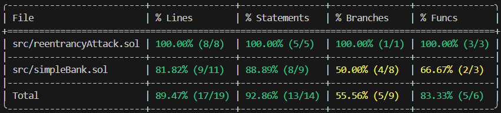

# Reentrancy Attack
## Overview 🪙
An example of a reentrancy attack on a contract pretending to be an Ether bank.
## Features 📃
* A contract representing the bank, with the options to deposit and withdraw funds.
* A malicious contract representing the attacker. This contract includes the famous "Reentrancy Attack" in its code.
* A test to verify that the malicious contract can successfully steal funds from all users in the bank contract.
## Technical details ⚙️
* Framework CLI -> Foundry.
* Forge version -> 1.1.0-stable.
* Solidity compiler version -> 0.8.24.
## Deploying the contract 🛠️
1. Clone the GitHub repository.
2. Open Visual Studio Code (you should already have Foundry installed).
3. Select "File" > "Open Folder", select the cloned repository folder.
4. In the project navigation bar, open the "testReentrancyAttack.t.sol" file located in the "test" folder.
5. In the toolbar above, select "Terminal" > "New Terminal".
6. Select the "Git bash" terminal (previously installed).
7. Run the command `forge test -vvvv --match-test` followed by the name of a test function to test it and verify the smart contract functions are working correctly. For example, run `forge test -vvvv --match-test testUserCanDeposit` to test the `testUserCanDeposit` function.
8. Run `forge coverage` to generate a code coverage report. This helps identify areas outside the coverage that could be exposed to errors/vulnerabilities.
   
## Functions (simpleBank) 🏦
* `deposit()` -> Deposit ether in the bank.
* `withdraw()` -> Withdraw all the ether that the user has deposited in the bank.
* `totalBalance()` -> Displays the amount of ether that all users have deposited into the bank.

## Functions (reentrancyAttack) 👹
* `attack()` -> Deposit ether into the bank to withdraw it later and launch the reentrancy attack.
* `receive()` -> This function will be executed in each iteration of the attack and will verify that there is still ether to steal from the bank, if not, the attack ends.
  
## Testing functions ✅
* `testUserCanDeposit()` -> Verify that any user can deposit ether to the bank.
* `testUserCanWithdraw()` -> Verify that any user can withdraw ether from the bank.
* `testAttackerCanSteal()` -> Verify that the reentrancy attack executes correctly.

## Forge Coverage ✅
  

CODE IS LAW!
